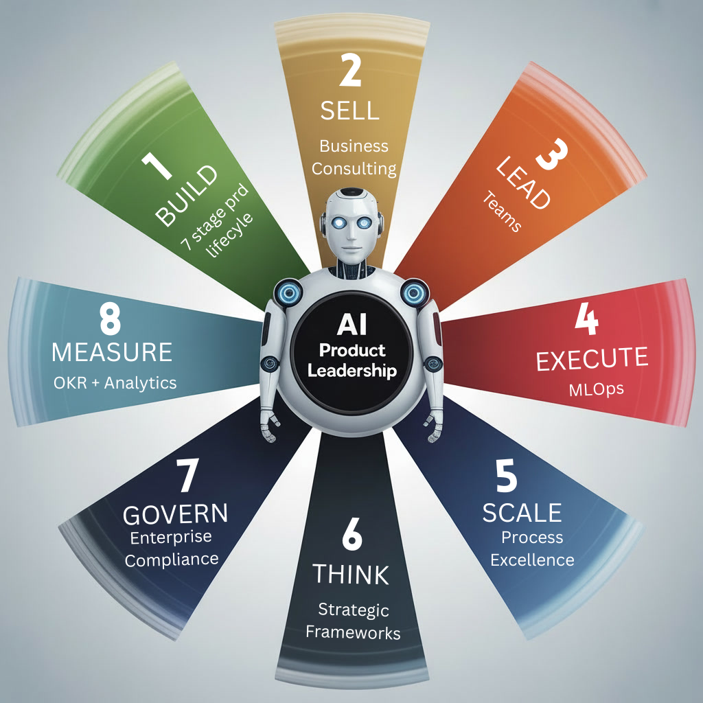

# Navigation

- [About Me](#About-Me)
- [Knowledge Systems](#knowledge-systems)
- [Professional Experience](#Professional-Experience-Impact)
- [Certifications](#certifications)
- [Projects](#Featured-Projects)
- [Competency Map](#Competency-Map)
- [Tech Mastery](#Technical-Mastery-Business-Impact)
- [Thought Leadership](#Continuous-Learning-Thought-Leadership)
- [Resume](#Resume)
- [Contact](#contact)

## About Me 
| AI Product Leader | Technical Manager |

> I lead product organizations at enterprise scale, blending deep engineering expertise, MBA-level strategic frameworks, and senior product leadership to deliver multimillion-dollar business impact.

> **Led teams across Engg/DS/Design** from customer discovery through production launches, achieving **95% on-time delivery** and **significant business results**. 

> Specialize in architecting production-grade PRDs, C-suite aligned roadmaps, and scalable operating models that translate complex technical requirements into stakeholder business objectives.

---

## Contact

+ **Status:** Open to Executive, Director-level AI PM roles

| | |
| :--- | :--- |
| **📧 Email:** | karthik_prdmgr@hotmail.com |
| **💼 LinkedIn:** | [Connect on LinkedIn](www.linkedin.com/in/karthik-dir) |
| **🤝 Working Style** | [Collaboraton guide](./profile/working-style.md) |
| **🤝 GitHub** | [Git](https://github.com/Karthik-pmlead/Karthik-pmlead) |

---

## Professional Experience Impact

- **Led** technical teams (Engg/DS/Design) through complete product lifecycles, achieving **95% on-time delivery**
- **Architected** AI product roadmaps aligning C-suite priorities with scalable technical execution
- **Delivered** high-impact launches by translating complex ML requirements into stakeholder-ready strategies

[↑ Back to top](#top)

---

##  Certifications

| Section | Link |
|:--------|:-----|
| **🏆 Certifications** | [Full Certifications](./profile/certifications.md) |

---

## Featured Projects

| **💼 Projects** |  [Projects Index](https://github.com/Karthik-pmlead/ai-product-leadership/tree/main/08-ai-product-thinking/07-projects) |

| Project | Description | Tech Stack | Key Concepts | Demo | Repo |
|---|---|---|---|---|---|
| **AI Decision Intelligence Platform** | Real-time operational intelligence platform that analyzes business, customer, and operational signals to generate explainable insights and recommendations. | FastAPI, React, WebSockets, Recharts | AI Orchestration, Explainable AI, Operational Intelligence, Real-Time Systems | [Video](https://drive.google.com/file/d/1BHj0T5WeL4iTuwmcPYbn_8026cH6RGnQ/view?pli=1) | [GitHub](https://github.com/Karthik-pmlead/ai-product-leadership/tree/main/08-ai-product-thinking/07-projects/ai-decision-intelligence-platform) |
| **Retail Recommendation System** | Real-time personalized recommendation engine that dynamically adapts to user browsing behavior using session-based ranking and engagement optimization. | FastAPI, React, WebSockets | Recommendation Systems, Session-Based Ranking, A/B Testing, Personalization | [Video](https://drive.google.com/file/d/1w_4tmZQCk_6XbIfuastUaJonf013qcla/view) | [GitHub](https://github.com/Karthik-pmlead/ai-product-leadership/tree/main/08-ai-product-thinking/07-projects/real-time-retail-recommendation-system) |
| **Market Intelligence & Risk Graph Platform** | AI-powered market intelligence system that correlates financial, operational, and risk signals across entities and events. | FastAPI, React, NetworkX | Risk Intelligence, Knowledge Graphs, Event Correlation, Entity Analysis | [Video](https://drive.google.com/file/d/1Dtm31bhvmrCkezcF27Ef3bd4MeJ6LWVr/view) | [GitHub](https://github.com/Karthik-pmlead/ai-product-leadership/tree/main/08-ai-product-thinking/07-projects/financial-risk-graph-intelligence) |
| **Sentiment Intelligence Platform** | Real-time sentiment monitoring system that analyzes customer and operational signals to identify trends, risks, and engagement patterns. | FastAPI, Transformers, React | NLP, Sentiment Analysis, Explainability, Streaming Analytics | [Video](https://drive.google.com/file/d/145Y7sMMRVpnD88HvulEy8ul_hGg9Fda-/view) | [GitHub](https://github.com/Karthik-pmlead/ai-product-leadership/tree/main/08-ai-product-thinking/07-projects/sentiment-intelligence-platform) |
| **AI Fatigue Detection System** | Computer vision system that detects driver/operator fatigue using eye movement, blink rate, and head pose estimation for safety monitoring. | OpenCV, MediaPipe, FastAPI, React | Computer Vision, Fatigue Detection, Real-Time Monitoring, Human Safety AI | [Video](https://drive.google.com/file/d/1f7WsQwBFYpVdbNWk4hAkC4JQVYeD0NEj/view) | [GitHub](https://github.com/Karthik-pmlead/ai-product-leadership/tree/main/08-ai-product-thinking/07-projects/driver-fatigue-system) |
| **Face Recognition & Smart Attendance System** | Real-time face recognition platform for secure attendance, identity verification, and access monitoring using facial embeddings. | OpenCV, Face Recognition, FastAPI, React | Face Recognition, Biometrics, Identity Verification, CV Pipelines | [Video](https://drive.google.com/file/d/1XPPhIGygHuuv1DJTwd2UAVQDJkVUyq6B/view) | [GitHub](https://github.com/Karthik-pmlead/ai-product-leadership/tree/main/08-ai-product-thinking/07-projects/face-recognition-system) |
| **Retail Customer Journey Analytics Pipeline** | End-to-end cloud-based analytics pipeline that transforms raw retail data into customer journey insights (funnel, cohorts, retention). Includes data ingestion, SQL transformations in BigQuery, and visualization via Tableau and a Streamlit app for interactive analysis. | GCP (BigQuery, Cloud Storage), AWS, SQL, Python, Streamlit, Tableau | End-to-end data platform design, Customer 360 modeling, Journey funnel reconstruction, Identity resolution, Event-driven architecture, Analytical data modeling, Metric standardization, Business intelligence layer design, Self-serve analytics systems | [Video]() | [GitHub](https://github.com/Karthik-pmlead/ai-product-leadership/tree/main/08-ai-product-thinking/07-projects/retail-customer-journey-analytics) |
| **AI Market Volatility Forecaster** | LSTM-based platform predicting volatility & price direction (58–62% accuracy vs. 48% random) to solve $10B/year hedging errors; detects liquidity crashes (85% recall) and quantifies uncertainty (95% CI) for LSEG/JPM/Bloomberg. | Streamlit, Flask, PyTorch LSTM, yfinance, FinBERT | - LSTM memory (60-day patterns) Multi-modal input (Price + Sentiment) Dynamic volatility (vs. constant BS) 95% confidence intervals | [Video]() | [GitHub](https://github.com/Karthik-pmlead/ai-product-leadership/tree/main/08-ai-product-thinking/07-projects/ai_market_volatility_forecaster) |
| **AI Product Strategy Framework Repository** | Structured PM/AI strategy repository containing PRDs, system design frameworks, AI governance, and operational execution models. | Markdown, Mermaid, GitHub | Product Strategy, AI Governance, System Design, Leadership Frameworks | --- | [GitHub](https://github.com/Karthik-pmlead/ai-product-leadership/tree/main/08-ai-product-thinking) |[↑ Back to top](#top)

---

## Competency Map

| SNo | Competency | Folder | Key Proof |
|-----|------------|--------|-----------|
| 1.0 | **Build** | [prd-mgmt/](https://github.com/Karthik-pmlead/ai-product-leadership/tree/main/02-prd-mgmt) | 7-stage 0→1 lifecycle |
| 2.0 | **Sell** | [business-consulting/](https://github.com/Karthik-pmlead/ai-product-leadership/tree/main/01-business-consulting) | $15M ARR models |
| 3.0 | **Lead** | [leadership/](https://github.com/Karthik-pmlead/ai-product-leadership/tree/main/03-leadership) | 50+ engineers, 95% delivery |
| 4.0 | **Execute** | [project-mgmt/](https://github.com/Karthik-pmlead/ai-product-leadership/tree/main/05-project-mgmt)  | MLOps + case studies |
| 5.0 | **Scale** | [process-excellence/](https://github.com/Karthik-pmlead/ai-product-leadership/tree/main/04-process-excellence) | Operating model |
| 6.0 | **Think** | [ai-product-thinking/](https://github.com/Karthik-pmlead/ai-product-leadership/tree/main/08-ai-product-thinking) | Mental models |
| 7.0 | **Govern** | [security-compliance/](https://github.com/Karthik-pmlead/ai-product-leadership/tree/main/07-security-compliance) | Enterprise AI |

## Technical Mastery Business Impact

| Category | Core Competencies | Quantified Business Value |
|:---------|:------------------|:--------------------------|
| **🤖 AI/ML Leadership** | • **RecSys:** XGBoost, LightFM  • **NLP:** BERT, RAG systems, fine-tuning • **GenAI:** Implementation & evaluation | **+22% CTR** on flagship recommendation engine **-85% hallucinations** in customer-facing AI assistant |
| **📊 Data & Experimentation** | • Advanced SQL & Python analytics • Statistical A/B testing design • ML lifecycle (MLflow, experiment tracking) | **40% faster feature development cycles** **Data-informed decisions** across product suite |
| **🎯 Product Execution** | • PRDs, OKRs, MLOps roadmaps • Technical ↔ business translation • Stakeholder alignment & communication | **95% on-time product delivery** record **Clear strategy-to-execution** translation |
| **📈 Technical Storytelling** | • Executive Tableau dashboards • Interactive demos (Streamlit, Gradio) • ML concept visualization | **3x faster stakeholder buy-in** **Effective cross-functional alignment** |
| **☁️ Production Readiness** | • Cloud infra (GCP/AWS) • Containerization (Docker) • CI/CD (GitHub Actions), API design | **Production-scale deployments** **Zero critical post-launch incidents** |

[↑ Back to top](#top)

---

## Continuous Learning Thought Leadership

#### **📈 Leading Industry Voices**

| Resource | Description |
|-------|----------|
| [Lenny's Newsletter](https://www.lennysnewsletter.com/) | #1 PM newsletter with actionable insights |
| [CPO Club](https://cpoclub.com/) | Chief Product Officer Community |
| [Roman Pichler](https://www.romanpichler.com/) | Product Leadership & Strategy | 
| [Silicon Valley Product Group](https://www.svpg.com/) | Marty Cagan's product excellence principles |

#### **🤖 AI Product Management**

| Resource | Description |
|-------|----------|
| [DeepLearning.AI](https://deeplearning.ai) | Cutting edge AI & Machine Learning |
| [AI Product Management Community](https://aiproductmanagement.com/) | AI PM practitioners |
| [Reforge](https://reforge.com) | Product Growth |

#### **📊 Analytics & Data**

| Resource | Description |
|----------|-------------|
| [Amplitude Blgos](https://amplitude.com/blog) | Product analytics leadership |
| [Andrew Chen](https://andrewchen.com/) | Growth & Network Effects |
| [Product Coalition](https://productcoalition.com) | Product Management Insights |
| [Dept of Product](https://departmentofproduct.com) | Product Leadership Content |

[↑ Back to top](#top)

---

## Resume

📄 Download Resume: [View PDF](./Karthik_Rao_PrdMgr_Resume.pdf)

--- 

## Knowledge Systems
  
- AI Product Leadership → https://github.com/Karthik-pmlead/ai-product-leadership

[↑ Back to top](#top)

---

